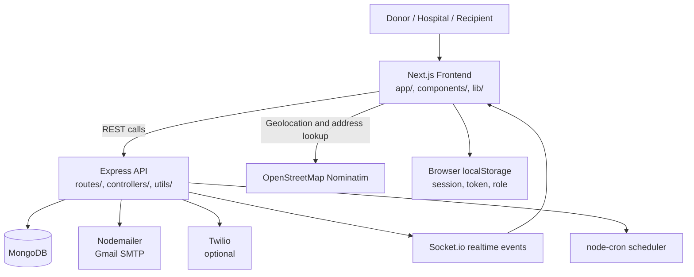
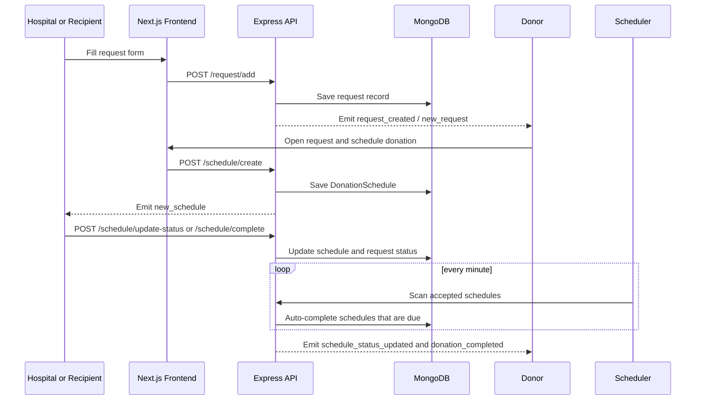

# PulseLife

PulseLife is a full-stack blood coordination platform that connects donors, hospitals, and recipients in one workflow.
This repository contains a Next.js frontend, an Express API, MongoDB data models, Socket.io realtime events, email notifications, and scheduled automation for donation completion.

## At A Glance

| Area | Details |
| --- | --- |
| Frontend | Next.js 14 App Router, React 18, TypeScript, Tailwind CSS, Radix UI, Leaflet |
| Backend | Express 5, MongoDB + Mongoose, Socket.io, Nodemailer, node-cron, Twilio optional |
| Auth | JWT login/register flow, session persisted in browser localStorage |
| Core Roles | Donor, Hospital, Recipient |
| External Services | OpenStreetMap Nominatim, Gmail SMTP, MongoDB Atlas or local MongoDB |

## What The Project Does

- Helps hospitals publish urgent blood or organ requests.
- Lets donors review requests, mark availability, and schedule donations.
- Lets recipients submit a request through a selected hospital and track status.
- Sends email updates when schedules are created, accepted, rejected, or completed.
- Broadcasts realtime backend events through Socket.io.
- Auto-completes accepted schedules after the scheduled time passes.
- Tracks donor history, cooldown rules, yearly donation limits, and rewards.

## System Architecture



### Architecture Notes

- The frontend is built with the Next.js App Router and uses role-based layouts to keep the UI focused.
- The backend exposes REST endpoints for auth, requests, schedules, hospitals, donor data, and email delivery.
- MongoDB stores users, requests, donation schedules, and completed donation history.
- Socket.io is wired on the backend for realtime room-based and broadcast events.
- Geolocation and reverse geocoding are used to turn coordinates into readable addresses.
- A cron job checks accepted schedules every minute and completes them automatically when due.

## Workflow



### Step By Step Flow

1. A user opens the landing page and chooses a role path.
2. The auth screen lets the user register or sign in as donor, hospital, or recipient.
3. The frontend stores the signed-in user, role, userId, and token in localStorage.
4. Hospitals or recipients create a request with blood or organ details, urgency, location, and the target hospital.
5. The backend saves the request in MongoDB and emits Socket.io events for live dashboards.
6. Donors review active requests, toggle availability, and schedule a donation if the request is compatible.
7. Hospitals review the schedule, accept or reject it, and then mark it completed when the donation is done.
8. The scheduler automatically completes accepted schedules once the scheduled time has passed.
9. The completion flow updates the request, writes a donation record, refreshes donor perks, and sends notification emails.

### Role Workspaces

| Role | Main Pages | Main Actions |
| --- | --- | --- |
| Donor | `donor/dashboard`, `donor/requests`, `donor/schedule-donation`, `donor/history`, `donor/stats`, `donor/perks`, `donor/profile` | View active requests, share availability, schedule donations, check perks, track history |
| Hospital | `hospital/dashboard`, `hospital/add-request`, `hospital/new-request`, `hospital/schedules`, `hospital/history`, `hospital/profile` | Create requests, review donor schedules, accept or reject, complete donations, manage hospital details |
| Recipient | `recipient/dashboard`, `recipient/create-request`, `recipient/request-status/[id]`, `recipient/history`, `recipient/settings`, `recipient/profile` | Create requests through a hospital, track request status, manage profile and preferences |

## Project Structure

```text
Frontend/
  app/
    page.tsx                  Public landing page
    about/page.tsx            Product overview page
    auth/page.tsx             Login and registration workspace
    donor/                    Donor dashboards and pages
    hospital/                 Hospital dashboards and pages
    recipient/                Recipient dashboards and pages
  components/                 Shared UI, role layouts, maps, location tools
  hooks/                      Role/session helpers and client hooks
  lib/                        API wrapper, types, formatting, session storage
  styles/globals.css          Global styles

Backend/
  server.js                   Express app, Socket.io, CORS, health check
  config/db.js                MongoDB connection helper
  controllers/                Auth, donor, request, and schedule logic
  routes/                     REST endpoint definitions
  models/                     Mongoose schemas
  utils/                      Email, donor perks, scheduler, completion helpers
  scripts/                    Maintenance and normalization scripts
```

### Frontend Highlights

- `app/page.tsx` is the landing page and explains the workflow in plain language.
- `app/auth/page.tsx` handles role selection, login, registration, and session storage.
- `components/role-layout.tsx` gives each role a dedicated workspace shell with navigation.
- `components/location-detector.tsx` supports geolocation and address-to-coordinate lookup.
- `components/leaflet-map-client.tsx` renders hospital, donor, and request points on a map.
- `lib/api.ts` centralizes API calls and uses `NEXT_PUBLIC_API_URL`.
- `lib/session.ts` manages user, role, token, and redirect paths.

### Backend Highlights

- `server.js` starts Express, sets up CORS, registers routes, creates Socket.io, exposes `/health`, and starts the scheduler after MongoDB connects.
- `controllers/requestController.js` handles request creation, request listing, and hospital confirmation.
- `controllers/scheduleController.js` handles schedule creation, status updates, and completion.
- `controllers/donorController.js` handles donor availability, history, schedules, and urgent request listing.
- `utils/completeDonation.js` updates donation history, donor perks, request status, and broadcasts completion events.
- `utils/scheduler.js` checks accepted schedules every minute and auto-completes due entries.

## Data Model

### User

Stores the signed-in person or organization.

- `fullName`, `email`, `password`, `phone`
- `role` values: `donor`, `hospital`, `recipient`, and legacy `user`
- `bloodType`, `gender`, `hospitalId`
- `available` and `location` for donor visibility
- `profileImage`, `address`
- `perks`, `totalDonations`, `donationsThisYear`, `lastHealthCheckupDate`, `nextEligibleDonationDate`

### Request

Represents a blood or organ request.

- `requestType`: `blood` or `organ`
- `bloodType` or `organType`
- `unitsNeeded`
- `hospital` and optional `destinationHospital`
- `urgency`: `HIGH`, `MODERATE`, `LOW`
- `searchRadiusKm` and legacy `locationKm`
- `location`, `requestedBy`, `recipientName`
- `isRecipientRequest`, `status`, `confirmationStatus`, `confirmedBy`, `confirmationNotes`

### DonationSchedule

Represents a donor's planned donation visit.

- `donorId`, `requestId`
- `donorLocation`, `contact`, `date`, `time`, `notes`
- `medicalEligibility` with age, weight, and fever or infection checks
- `status`: `pending`, `accepted`, `rejected`, `completed`
- `hospitalResponse`: `none`, `accepted`, `rejected`

### Donation

Stores completed donation history.

- `donorId`, `scheduleId`, `hospital`, `units`, `date`, `status`
- Indexed by donor and unique on `scheduleId`

## Business Rules

- Donor registration requires blood type and gender.
- Hospital registration requires a location before the account can be created.
- Login for hospital accounts also requires `hospitalId`.
- Donors can schedule only blood requests; organ requests are visible for awareness but not schedulable in the donor flow.
- Recipient requests are always routed through a hospital. There is no direct donor-to-recipient handoff.
- Donation scheduling checks age, weight, fever or infection status, yearly donation limits, and the 56-day cooldown.
- Accepted schedules can be completed manually or by the minute-based cron job once the scheduled time passes.
- Completing a donation updates request status, donor stats, donor perks, and notification emails.

## Realtime Events

| Event | Where It Comes From | Purpose |
| --- | --- | --- |
| `register` | Client to server | Joins a socket room using the user ID |
| `new_request` | Client or backend | Broadcasts a donor-facing urgent request |
| `urgent_request` | Server broadcast | Mirrors the request for connected clients |
| `request_created` | Backend | Announces a new hospital-created request |
| `recipient_request_created` | Backend | Sends a request to the selected hospital room |
| `availability_changed` | Backend | Broadcasts donor availability changes |
| `donor_status_changed` | Backend | Broadcasts donor state updates for dashboards |
| `new_schedule` | Backend | Notifies a hospital about a new donor schedule |
| `schedule_status_updated` | Backend | Announces schedule acceptance, rejection, or completion |
| `request_fulfilled` | Backend | Marks the request as fulfilled |
| `donation_completed` | Backend | Announces the final donation completion |

## API Reference

### Auth

| Method | Endpoint | Description |
| --- | --- | --- |
| POST | `/auth/register` | Register a new user |
| POST | `/auth/login` | Sign in and return a JWT |
| GET | `/auth/me` | Fetch the current user by ID or auth context |
| GET | `/auth/user/:id` | Fetch any user by ID |
| POST | `/auth/update-profile` | Update profile fields |

### Donor

| Method | Endpoint | Description |
| --- | --- | --- |
| POST | `/donor/availability` | Update donor availability and location |
| GET | `/donor/requests` | Load active urgent requests for the donor dashboard |
| POST | `/donor/add-donation` | Add a donation history record |
| GET | `/donor/history/:donorId` | Fetch donor donation history |
| GET | `/donor/schedules/:donorId` | Fetch donor schedule history |
| GET | `/donor/last-donation/:donorId` | Fetch cooldown and yearly limit info |

### Request

| Method | Endpoint | Description |
| --- | --- | --- |
| POST | `/request/add` | Create a blood or organ request |
| GET | `/request/all` | List all requests with enriched location and hospital details |
| POST | `/request/:requestId/confirm` | Hospital confirms or rejects a request |

### Schedule

| Method | Endpoint | Description |
| --- | --- | --- |
| POST | `/schedule/create` | Create a donor donation schedule |
| POST | `/schedule/update-status` | Accept or reject a schedule |
| POST | `/schedule/complete` | Mark a donation as completed |
| GET | `/schedule/donor/:donorId` | List schedules for one donor |

### Hospital

| Method | Endpoint | Description |
| --- | --- | --- |
| GET | `/hospital/all` | List hospitals with valid locations |
| GET | `/hospital/stats` | Return donor, schedule, and match-time metrics |
| GET | `/hospital/active-donors` | Return donors currently marked available |
| GET | `/hospital/schedules/:hospitalName` | Return schedules for a hospital |
| POST | `/hospital/seed-hospitals` | Seed test hospitals for development |
| POST | `/hospital/reset-hospitals` | Reset and recreate the seeded hospitals |
| POST | `/hospital/update-location` | Update hospital coordinates and address |

### Email And Health

| Method | Endpoint | Description |
| --- | --- | --- |
| POST | `/email/send-donation-scheduled` | Send schedule notification emails |
| GET | `/health` | Health check for deployments |

## Automation And Rules Engine

- `Backend/utils/scheduler.js` runs every minute and auto-completes accepted schedules after their scheduled time.
- `Backend/utils/donorBenefits.js` enforces the 56-day cooldown, yearly donation limits, and perk generation.
- `Backend/utils/completeDonation.js` performs the final write path for completed donations and emits completion events.
- `Backend/scripts/normalizeRequestConfirmationState.js` repairs legacy request records so confirmation status stays consistent.

## Local Setup

### Prerequisites

- Node.js 18 or newer
- MongoDB running locally or a MongoDB Atlas connection string
- A Gmail account with an app password if you want email delivery
- Optional Twilio credentials if you plan to use SMS features

### 1. Clone The Repository

```bash
git clone <your-repo-url>
cd PulseLife
```

### 2. Install Frontend Dependencies

```bash
cd Frontend
npm install
```

### 3. Install Backend Dependencies

```bash
cd ../Backend
npm install
```

### 4. Configure Environment Variables

Create `Frontend/.env.local`:

```env
NEXT_PUBLIC_API_URL=http://localhost:5000
```

Create `Backend/.env`:

```env
MONGO_URI=mongodb://127.0.0.1:27017/pulselife
JWT_SECRET=your_secret_value
PORT=5000
FRONTEND_URL=http://localhost:3000

EMAIL_USER=your_email@gmail.com
EMAIL_PASS=your_app_password

TWILIO_ACCOUNT_SID=optional
TWILIO_AUTH_TOKEN=optional
TWILIO_PHONE_NUMBER=optional

MONGO_DNS_SERVERS=optional_comma_separated_dns_servers
FRONTEND_URLS=optional_comma_separated_frontend_origins
```

### 5. Run The App

Open two terminals.

Frontend:

```bash
cd Frontend
npm run dev
```

Backend:

```bash
cd Backend
npm run dev
```

The frontend runs on `http://localhost:3000` and the backend runs on `http://localhost:5000` by default.

## Deployment

The project is prepared for Render with `../render.yaml`.

- Backend service name: `pulselife-api`
- Frontend service name: `pulselife-web`
- Backend root: `Backend`
- Frontend root: `Frontend`
- Backend health check: `/health`

### Render Environment Variables

Backend:

- `MONGO_URI`
- `FRONTEND_URL`
- `EMAIL_USER`
- `EMAIL_PASS`
- `TWILIO_ACCOUNT_SID`
- `TWILIO_AUTH_TOKEN`
- `TWILIO_PHONE_NUMBER`

Frontend:

- `NEXT_PUBLIC_API_URL`

### Deployment Flow

1. Push the repository to GitHub, GitLab, or Bitbucket.
2. Create a Render Blueprint service using `render.yaml`.
3. Set the backend and frontend environment variables.
4. Redeploy both services after the public URLs are in place.

For the full Render walkthrough, see `../RENDER_DEPLOYMENT.md`.

## Scripts

### Frontend

| Command | Description |
| --- | --- |
| `npm run dev` | Start the Next.js dev server |
| `npm run build` | Build the production app |
| `npm run start` | Start the built app |
| `npm run lint` | Run ESLint |

### Backend

| Command | Description |
| --- | --- |
| `npm run dev` | Start the backend with Nodemon |
| `npm start` | Start the production server |
| `npm run normalize:requests` | Repair legacy request confirmation data |

## Security And Validation

- Passwords are hashed with `bcrypt`.
- Login returns a JWT signed with `JWT_SECRET`.
- CORS only allows configured frontend origins.
- Request and schedule controllers validate required fields and business rules before writing to the database.
- The frontend uses role-based route guards and localStorage session helpers to keep users in the right workspace.

## Notes

- The frontend includes map and location tooling, but map data only appears when users have valid coordinates saved.
- The backend can send emails even when one notification fails because email dispatch is handled with non-blocking background tasks.
- The repo also includes `vercel.json` if you want to deploy the Next.js app on Vercel separately.

## Related Files

- `../render.yaml`
- `../RENDER_DEPLOYMENT.md`
- `app/page.tsx`
- `app/auth/page.tsx`
- `components/role-layout.tsx`
- `../Backend/server.js`
- `../Backend/utils/scheduler.js`
